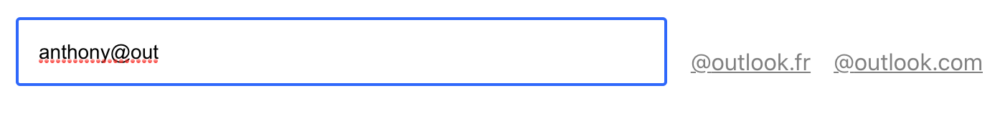
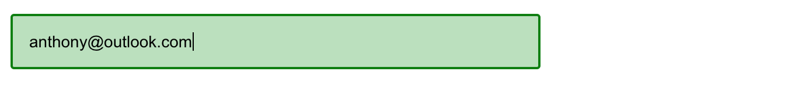

<!-- Please update value in the {}  -->

<h1 align="center">Email-Input-Puzzle</h1>

<div align="center">
   Solution for a challenge from  <a href=https://www.planity.com/ target="_blank">Planity</a>.
</div>

<div align="center">
  <h3>
    <a href="https://anthonydecuyper-email-input-puzzle.netlify.app">
      Demo
    </a>
  </h3>
</div>

<!-- TABLE OF CONTENTS -->

## Table of Contents

- [Overview](#overview)
  - [Built With](#built-with)
- [Features](#features)
- [How to use](#how-to-use)
- [Contact](#contact)
- [Acknowledgements](#acknowledgements)

<!-- OVERVIEW -->

## Overview



<div align="center">------------------</div>



<!-- Introduce your projects by taking a screenshot or a gif. Try to tell visitors a story about your project by answering:

- Where can I see your demo?
- What was your experience?
- What have you learned/improved?
- Your wisdom? :) -->

### Built With

<!-- This section should list any major frameworks that you built your project using. Here are a few examples.-->

- [React](https://reactjs.org/)

## Features

<!-- List the features of your application or follow the template. Don't share the figma file here :) -->

This application/site was created as a submission to a [planity](https://www.planity.com/) challenge.

## How To Use

<!-- Example: -->

### Prerequisites
[yarn](https://yarnpkg.com/)

### Installation

```bash
# Clone this repository
$ https://github.com/decuyperanthony/email-input-puzzle

# Install dependencies
$ yarn

# Run the app
$ yarn start
```


## Contact

- Website [www.anthonydecuyper.fr](https://anthonydecuyper.netlify.app/)
- GitHub [@decuyperanthony](https://github.com/decuyperanthony)